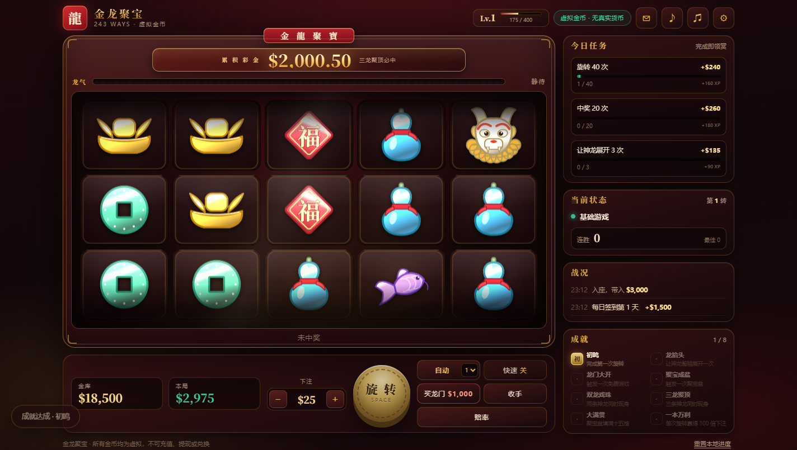
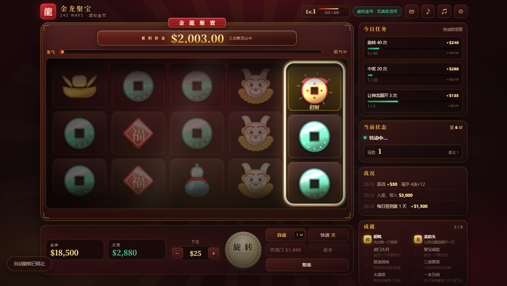

# 金龙聚宝 · 243 Ways

一个只用虚拟金币的 5 轴 3 行、243 Ways 老虎机。纯前端，无框架、无构建、无音频素材 ——
图标是 Canvas 矢量手绘，音效是 WebAudio 实时合成。



在线试玩：<https://hasai666.github.io/aster-game/>

## 玩法

| 图标 | 作用 |
| --- | --- |
| 铜钱 / 福字 / 宫灯 | 低分图标 |
| 玉葫芦 / 锦鲤 | 中分图标 |
| 元宝 / 貔貅 | 高分图标，貔貅是头奖 |
| **神龙（百搭）** | 只出现在第 2/3/4 轮，落轴后**整轴展开**，替代所有普通图标 |
| **金锣（Scatter）** | 任意 3/4/5 个 → 赔 2×/10×/50×，并开启 **9/14/20** 次免费旋转 |
| **招财钱币** | 积攒**龙气**；3 枚以上另有散赔 |

### 特殊组合

- **双龙戏珠**　2 条神龙同屏 → 本次旋转 2×，龙气大幅上涨（约 117 转一次）
- **三龙聚顶**　3 条神龙同屏 → 本次旋转 3×，**龙气直接充满**（约 5300 转一次）
- **满堂金**　　3 枚以上招财钱币 → 龙气额外上涨（约 276 转一次）
- **龙锣共鸣**　2 个金锣 + 至少 1 条神龙 → 神龙化锣，补足触发免费游戏（约 186 转一次）

### 龙门免费游戏

3/4/5 个金锣 → 9/14/20 次。起始 **4×** 倍率，每有一次中奖旋转 +1×（上限 8×），期间再出 3 个金锣可 +5 次。
免费游戏用独立轮带：神龙和钱币都更密。平均产出 **47 倍下注**。

**每一次免费旋转都由玩家自己按**，不自动连转。轮到你按的时候，旋转键会自己发光脉冲。

不想等的话可以直接 **买龙门**（50× 下注），档位分布和自然触发完全一致 —— 买到的和撞到的是同一个东西。

### 聚宝盆（Hold & Spin）

龙气是**刻意不显示数字**的：只有一条会发光的鳞片进度条和「聚气中 / 龙气渐盛 / 将满」这类定性文字。
充满后进入聚宝盆——盘面清空，落下的钱币锁定并带有面值，初始 3 次重转，
每次落新币就重置回 3 次，填满 15 格额外奖励 200×。平均产出 **33 倍下注**。

**每一次重转也都由玩家自己按**，而且一次比一次转得久（1.6s 起，每轮 +0.28s，上限 3.6s）。
重转用的就是普通游戏那套滚轮 —— 只有已经锁定的钱币格纹丝不动，其余格子照常滚。
结束时是整局最大的一次演出：满屏冲击波 + 放射光 + 持续五秒多的金币暴雨。

### 累积彩金

每一次付费旋转都把下注的 **2.5%** 投进彩金池，数字带两位小数一直在涨。
随机触发（约 1/2,500），**三龙聚顶必中**，合起来约每 1,740 转命中一次，平均带走 **40 倍下注**。

命中后池子不会归零：底金从一条隐藏储备里垫出来，而那条储备同样来自玩家的投入 ——
所以长期 RTP 恰好等于投入比例，不多给也不少给。

### 局外成长

| 系统 | 作用 |
| --- | --- |
| **财神等级** | 每次旋转按下注额获得经验，升级发金币；Lv.4 解锁 $100 下注、Lv.8 解锁 $250 |
| **今日任务** | 常驻 3 条，完成即领赏并立刻补一条新的，永远有短期目标 |
| **每日签到** | 7 天递增（$1,500 → $18,000），断一天从头再来 |
| **连胜** | 连续中奖会点亮计数器，3 连转暖、5 连起燃 |

这四样发的都是**金库**里的虚拟金币，属于水龙头，和老虎机的 RTP 是两套账。

## 数值

数值不是拍脑袋定的。`js/config.js` 是唯一的数值来源，`js/engine.js` 是纯逻辑引擎，
游戏本体和蒙特卡洛模拟器跑的是**同一份代码**。下面的数字来自 3000 万次旋转、3 个随机种子的实测：

| 指标 | 实测值 |
| --- | --- |
| RTP | **96.2%** |
| 命中率（按轮，含免费旋转产出） | 20.8% |
| ├ 其中低于下注的"小额回收" | 15.1% |
| 单轮回报标准差 | 16.4（中高波动） |
| 单次旋转封顶 | 2500× 下注 |
| 龙门免费游戏 | 约每 111 转一次，平均产出 **47×** |
| 聚宝盆 | 约每 112 转一次，平均 **33×** / 7.5 枚钱币 |
| 累积彩金 | 约每 1,740 转一次，平均 **40×** |
| 大满贯（15 格全满） | 约每 21,000 转一次 |

### RTP 押在玩法上，不押在基础游戏上

| 来源 | 占比 |
| --- | --- |
| 基础游戏 243 Ways | 29% |
| 龙门免费游戏 | 36% |
| 聚宝盆（基础 + 免费） | 32% |
| 累积彩金 | 2.5% |
| 金锣 / 钱币散赔 | 2% |

基础游戏刻意压得很薄 —— **七成的返还都在玩法里**。这样进一次龙门或聚宝盆是真的能翻盘，
代价是平时的小奖更寡淡。这是明确的取舍，不是配漏了。

同时把下注档位抬到了 $10–$250（默认 $25），一次买入约 120 转 ——
一次 33 倍的聚宝盆就是本局余额的四分之一强，感受得到。

结构上用了两个真实老虎机的常用手法：

- **堆叠轮带**：低分图标在轮带上成组出现。总数不变，但"中了就中一大片"——
  命中率下降、单次 Ways 数上升，这是中高波动手感的主要来源。
- **神龙只在 2/3/4 轮**：第 1 轮永远需要真实图标，杜绝纯 Wild 中奖，
  也让神龙落轴本身变成一个事件。

### 反馈取向：按真实老虎机的那一套来

这个版本是**刻意做"上头"的**，两处照搬了真机的心理设计：

- **小额也庆祝（LDW）**：赢得金额低于下注时（约 13.4% 的轮次）照样弹横幅、放礼花、奏乐，
  只是体量比大奖小。业界管这叫 losses disguised as wins —— 一次净亏损被演成"赢了"。
- **擦边球（near miss）**：最后一轴会先"差一点点"停住、顿住半秒、其余轴压暗打聚光，
  再蠕动到真正的位置。前面已落 2 个金锣时必定触发，没有真实机会时也有 22% 概率照吊不误。



两者都**不改变任何赔付**——RTP、命中率、波动性和上一版完全一致，改的只有演出。
之所以在这里做，是因为它只用虚拟金币、不接任何支付通道；同样的设计放在真钱场景是另一回事。
不想要的话，把 `js/config.js` 里 `FEATURES.tease.chance` 调成 0、
把 `WIN_TIERS` 里 `tiny` 档的 `fx` 调成 0 即可。

## 运行

直接用浏览器打开 `index.html` 即可，没有任何依赖。也可以起个静态服务器：

```
python -m http.server 8000
```

## 开发工具

| 文件 | 用途 |
| --- | --- |
| `tools/sim.html` | 蒙特卡洛验证。浏览器打开即可，`?spins=1000000&seeds=1,2` 可调 |
| `tools/symbols.html` | 图标检视表：大图 / 实际尺寸 / 56px 剪影辨识度 |
| `tools/drive.py` | 端到端检查。CDP 驱动真实渲染的 Chrome，点按钮、等状态、逐场景截图 |

`tools/drive.py` 需要 `websocket-client`。headless Chrome 的 `--screenshot` 模式下
requestAnimationFrame 基本不推进，截不到任何动画，所以改用 DevTools Protocol。

改动 `js/config.js` 里任何权重或赔率后，请重新跑一次 `tools/sim.html` 确认 RTP。

## 代码结构

```
js/config.js   数值唯一来源：图标、赔率、轮带权重、堆叠、玩法参数
js/engine.js   纯数学引擎，不碰 DOM；浏览器和模拟器共用
js/art.js      十个图标的 Canvas 矢量画笔（金箔浮雕风格）
js/audio.js    WebAudio 合成音频：古筝拨弦、锣、太鼓、五声音阶背景乐
js/render.js   Canvas 盘面：真实滚轮物理、方向性动态模糊、擦边球顿停、聚宝盆
js/fx.js       全屏特效：金币暴雨、冲击波、放射光、闪光、震屏
js/app.js      状态机、演出编排、等级/任务/签到/彩金等局外系统
```

设计文档见 `docs/specs/2026-09-30-jinlong-slots-redesign.html`。

## 声明

所有金币均为虚拟，只保存在当前浏览器的 localStorage 里。
不接入账号、支付、充值、提现或任何形式的兑换。
